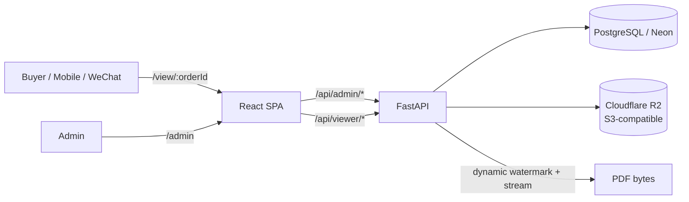

# Yantu (研途LOL / RedDoc)

面向数字资料的虚拟商品自动化发货与版权保护系统：后台管理商品与发货记录，给买家生成“订单号 + 密码”的在线阅读链接；阅读端在通过密码验证后再加载 PDF，并为每次预览动态写入可追溯水印；支持确认收货后下载加密 PDF，以及退款后立即作废凭证与阅读权限。

本仓库默认以“单容器”方式运行：同一个 Cloud Run 服务同时提供 API (`/api/*`) 与前端 SPA (`/admin`、`/view/:orderId`)。

## 功能概览

- 后台管理
  - 管理员登录（JWT）
  - 商品管理（PDF 为主，可上传封面图、附件）
  - 发货创建订单（生成阅读链接与一次性访问密码）
  - 发货记录查询、筛选、排序（按时间、金额等）
  - 售后：确认收货、退款作废、重置访问密码
  - 团队管理：新增管理员、管理员删除（超管可级联删除关联订单，带二次确认）
  - 系统监控页：数据库核心指标、访问情况、对象存储(R2)近似容量统计

- 阅读端
  - 必须先输入订单密码才能获取文档（密码换取短期 viewer token）
  - 在线预览：动态水印、按需流式输出，退款后立即失效
  - 确认收货后下载：实时生成“加密 PDF”（需使用同一访问密码打开）

## 业务流程

1. 超级管理员配置环境变量并启动服务（可选一次性 `BOOTSTRAP_*` 自动创建首个超管账号）。
1. 后台创建商品并上传源 PDF。
1. 后台“新建发货”创建订单，系统会生成 `order_id`、`viewer_url`（阅读入口）以及 `password`（只展示一次，可复制发送给买家）。
1. 买家打开阅读链接，输入密码，服务端签发短期 `viewer_token`。
1. 阅读端用 `viewer_token` 拉取动态水印 PDF 进行预览。
1. 退款后新的 `viewer/auth` 会被拒绝；已获取的 `viewer_token` 在下一次请求时也会被拒绝（服务端实时校验订单状态）。

## 架构与技术栈



- 前端：React 18 + Vite + `pdfjs-dist`
- 后端：FastAPI + Uvicorn
- 数据库：SQLAlchemy + PostgreSQL（生产推荐 Neon），本地默认 SQLite 便于启动
- 对象存储：Cloudflare R2（S3 兼容）。Cloud Run 生产环境建议必须开启
- PDF 处理：PyMuPDF（动态水印、下载加密 PDF 生成）
- 部署：Docker 多阶段构建，一套镜像部署到 Cloud Run

## 目录结构

- `frontend/`：前端 SPA（后台 + 阅读端）
- `backend/`：FastAPI 后端、模型、PDF 处理、存储抽象
- `Dockerfile`：多阶段构建（先 build 前端，再打包后端 + 前端 dist）
- `docker-compose.yml`：本地 Postgres（可选）
- `scripts/start_local.ps1`：本地启动（后端热重载 + 前端 Vite 或 dist 代理）
- `deploy_gcp.ps1`：部署到 GCP（Cloud Build + Cloud Run）
- `seed_gcp.ps1`：创建并执行 Cloud Run Job 进行生产种子数据初始化
- `env-prod.example.yaml`：生产环境变量模板（请勿提交真正的密钥）
- `env-bootstrap.example.yaml`：包含一次性 `BOOTSTRAP_*` 的模板

## 环境变量

本项目通过 Pydantic Settings 读取环境变量，默认读取项目根目录 `.env`，也支持通过 `ENV_FILE` 指定配置文件。

生产部署建议使用 `env-prod.yaml`（本仓库已在 `.gitignore` 忽略 `env-*.yaml`，避免泄露密钥）。

必需（生产）：

- `ENVIRONMENT`: `"prod"`
- `JWT_SECRET_KEY`: 用于签发后台 JWT、派生部分加密用途的默认密钥
- `DATABASE_URL`: PostgreSQL 连接串（Neon 需 `sslmode=require` 等参数）
- `R2_ENDPOINT_URL`
- `R2_ACCESS_KEY_ID`
- `R2_SECRET_ACCESS_KEY`
- `R2_BUCKET_NAME`

可选（一次性初始化，首次可用后建议移除）：

- `BOOTSTRAP_ADMIN_USERNAME`
- `BOOTSTRAP_ADMIN_PASSWORD`
- `BOOTSTRAP_ADMIN_NICKNAME`

## 本地开发

1. 启动数据库（可选）

```powershell
cd D:\Project\Yantu
docker compose up -d
```

2. 准备本地环境变量

- 直接使用默认 SQLite：无需配置 `DATABASE_URL`
- 或复制并按需修改 `.env.example` 为 `.env.local`

3. 启动开发服务

```powershell
cd D:\Project\Yantu
.\scripts\start_local.ps1 -UseVite
```

默认：

- 后端文档：`http://127.0.0.1:8000/docs`
- 前端：`http://127.0.0.1:5173`

## 生产部署 (Cloud Run)

### 方式 A：从源码构建并部署（推荐）

```powershell
cd D:\Project\Yantu
Copy-Item .\env-prod.example.yaml .\env-prod.yaml
# 编辑 env-prod.yaml 填入你的 DATABASE_URL / R2_* / JWT_SECRET_KEY

gcloud run deploy yantu-api `
  --source . `
  --region asia-east1 `
  --allow-unauthenticated `
  --memory 1Gi `
  --port 8080 `
  --env-vars-file env-prod.yaml
```

说明：

- Cloud Run 服务会同时提供前端与后端：打开 Service URL 即可进入后台（`/admin`）。
- 若需要查看 Cloud Build 日志，注意 `--source` 触发的构建可能是“区域构建”，请在命令里加上对应 `--region`（或直接打开控制台链接）。

### 方式 B：先构建镜像，再用镜像部署

```powershell
cd D:\Project\Yantu

# 构建并推送（示例）
gcloud builds submit --config cloudbuild.cloudrun.yaml --substitutions _IMAGE=asia-east1-docker.pkg.dev/<PROJECT>/yantu/yantu:latest .

# 部署
gcloud run deploy yantu-api `
  --image asia-east1-docker.pkg.dev/<PROJECT>/yantu/yantu:latest `
  --region asia-east1 `
  --allow-unauthenticated `
  --memory 1Gi `
  --port 8080 `
  --env-vars-file env-prod.yaml
```

## 初始化种子数据（生产）

仓库提供一个 Cloud Run Job 用于向 Neon + R2 写入演示数据（商品、订单、管理员等）。

```powershell
cd D:\Project\Yantu
.\seed_gcp.ps1 -ProjectId <PROJECT_ID> -Region asia-east1 -EnvVarsFile env-prod.yaml
```

脚本内部会执行容器命令：

- `python /srv/backend/scripts/seed_neon_r2.py --require-r2 --purge`

## 安全说明（务实版）

- 后台：JWT Bearer（`/api/admin/*`）
- 阅读端：订单号+密码换取短期 `viewer_token`（默认 15 分钟），并在每次请求文档时实时校验订单状态
- 水印：在线预览时动态写入，不会把“水印后的文件”落盘或写入对象存储
- 下载：确认收货后生成“加密 PDF”，需要使用同一访问密码打开
- 退款：立即作废阅读权限与凭证，不再计入收入统计

提示：

- 任何“在线阅读”都无法 100% 防止截图或录屏，本系统的目标是“溯源与威慑 + 降低传播便利性”。
- 请务必保管好 `JWT_SECRET_KEY` 与 R2 密钥，不要提交到 git。

## Troubleshooting

- `Build failed` 且 `gcloud builds log <id>` 提示 NOT_FOUND
  - 可能是区域构建日志不在默认位置，优先使用 `gcloud run deploy --source` 输出的控制台链接查看。
- Cloud Run 报 `container failed to start and listen on the port`
  - 镜像需监听 `$PORT`，本项目默认 `8080` 且 `CMD` 已兼容 `PORT`。
- 预览 PDF 在微信环境兼容性差
  - 微信内置内核对 PDF/iframe 有限制，建议引导外部浏览器打开；前端已做尽量兼容与加载提示，但不同机型差异较大。

